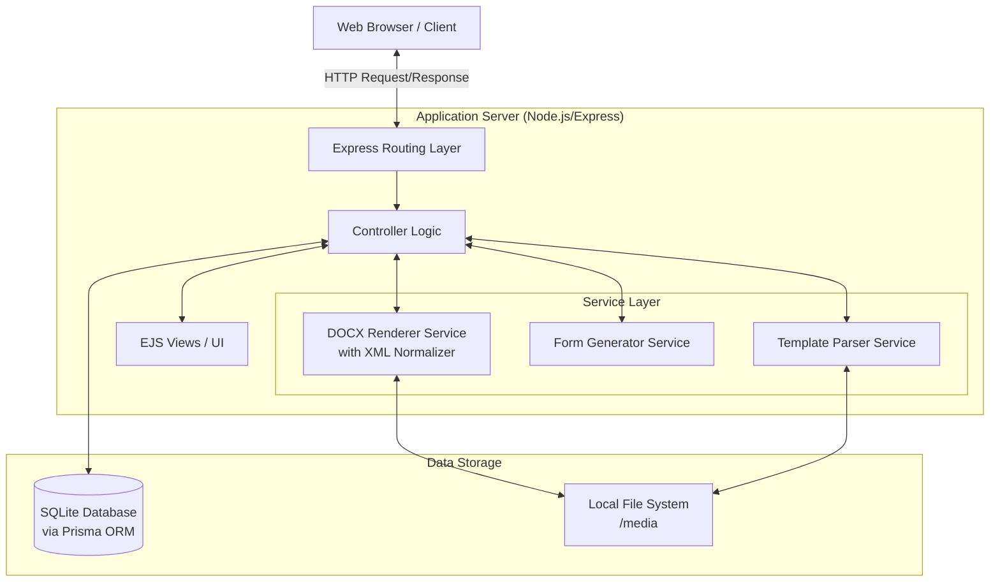
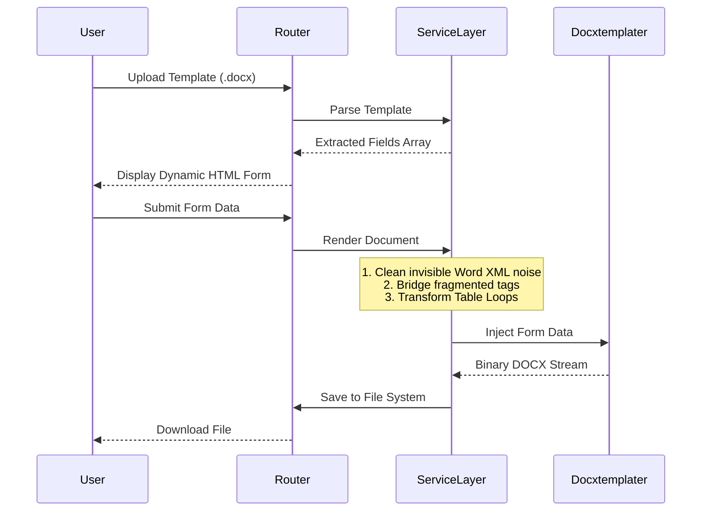
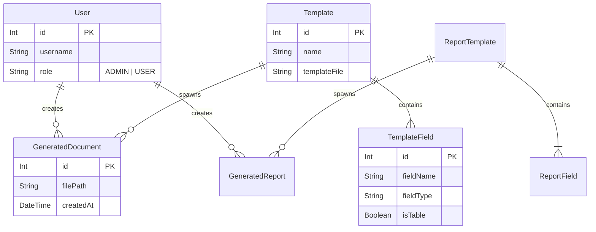

# System Architecture: Document Template & Report Generation Portal

This document outlines the detailed system architecture for the Document Template Portal. It is designed to be a robust, modular, and scalable Node.js application for parsing Microsoft Word templates, generating dynamic web forms, and rendering complex DOCX files with precise formatting.

---

## 1. High-Level Architecture Overview

The system follows a classic **Model-View-Controller (MVC)** architectural pattern, augmented with a powerful **Service Layer** to handle complex document processing logic.

---

## 2. Core Subsystems & Modules

The application is logically divided into two primary pipelines that share the same underlying technology but operate independently to ensure data integrity:
1. **Standard Document Pipeline** (Contracts, Invoices, Letters)
2. **Report Generation Pipeline** (Event Reports, Work Summaries, which support image handling and specialized schemas).

### 2.1 The Routing & Controller Layer
- **Auth Routes (`routes/auth.js`)**: Manages Passport.js local strategy authentication, user registration, and role-based access control (Admin vs. User).
- **Template Management (`templates.js`, `reportTemplates.js`)**: Handles file uploading (via Multer), stores templates in the file system, and creates initial database records.
- **Form Handling (`forms.js`, `reportForms.js`)**: Interfaces with the Parsing services to read freshly uploaded templates and generate dynamic HTML forms corresponding to the document's placeholders.
- **Document Generation (`docGen.js`, `reportGen.js`)**: Receives POST data from the UI, delegates to the Rendering services, and serves the finalized DOCX back to the client while logging the history.

### 2.2 The Service Layer (The Core Engine)
The service layer is the brain of the application, managing all binary and XML manipulation.

---

## 3. Database Schema Design (Prisma)

The database is built on **SQLite** and managed via **Prisma ORM**. It features strict relational integrity.

---

## 4. The Document Generation Pipeline (Technical Deep-Dive)

The most complex engineering challenge in this system is Microsoft Word's tendency to invisibly fragment placeholder tags (e.g., splitting `` across different XML runs due to spellcheck or style changes). The system handles this through a 4-stage pipeline inside `Renderer.js`:

1.  **Preparation**: Extracts `document.xml` using `PizZip`. 
2.  **XML Normalization (Decisive Cleaning)**: 
    - Analyzes raw XML to strip invisible noise like `<w:proofErr />`.
    - Uses High-Precision Regular Expressions to "bridge" runs. If Word split a tag but did not introduce layout changes (like line breaks or tabs), the system safely concatenates the split `w:t` (text) tags, ensuring tags like `` are rebuilt perfectly without damaging the document's visual formatting.
3.  **Hierarchy Reconstruction & Transformation**: Converts user-friendly loop syntax into `docxtemplater` native syntax (`{{#table}} ... {{/table}}`).
4.  **Injection**: `docxtemplater` injects the database maps into the normalized XML, and `PizZip` repackages the finalized `.docx`.

## 5. Technology Stack Summary

| Layer | Technology | Purpose |
| :--- | :--- | :--- |
| **Frontend** | EJS, Bootstrap 5 | Dynamic HTML rendering and responsive UI. |
| **Backend API** | Node.js, Express.js | Core application server, routing, and HTTP handling. |
| **Database** | SQLite, Prisma ORM | Relational data management and schema versioning. |
| **Authentication**| Passport.js, bcrypt | Secure password hashing and session management. |
| **File Handling** | Multer | processing `multipart/form-data` uploads. |
| **Doc Processing**| PizZip, XMLDOM, Mammoth | ZIP/XML manipulation and DOCX-to-HTML previews. |
| **Template Engine**| Docxtemplater | Secure injection of form data into Word files. |
